# Customer Churn Analysis and Retention Strategy

**Author:** Sanman Kadam  
**Live Application:** [Interactive Streamlit Dashboard](https://customer-churn-analysis.streamlit.app/)  
**Status:** Complete  
**License:** MIT

---

## Business Problem

A telecom company operating across 30+ regional circles in India is experiencing subscriber attrition across wireless and wireline segments. Customer churn directly translates to revenue loss, increased acquisition costs, and weakened competitive positioning.

The objective of this project is to:
- Identify the key drivers of subscriber churn at the regional and provider level
- Quantify the financial impact of subscriber attrition
- Build predictive models to flag at-risk segments before churn occurs
- Recommend actionable retention strategies backed by data

---

## Project Architecture

```
Raw Dataset (70K+ records)
        |
        v
  Data Cleaning & Standardization
  - Resolved naming inconsistencies across 30 circles
  - Standardized provider names, connection types
  - Removed duplicates, handled missing values
        |
        v
  Feature Engineering
  - Period-over-period subscriber changes
  - Rolling averages and volatility measures
  - Value-to-average ratio, categorical encoding
        |
        v
  Exploratory Data Analysis
  - Churn by circle, connection type, provider
  - Geographic hotspot identification
  - Revenue impact quantification
        |
        v
  Predictive Modeling
  - Logistic Regression (baseline)
  - Random Forest
  - XGBoost (selected model)
        |
        v
  Risk Segmentation
  - Composite scoring (0-100)
  - Critical / High / Medium / Low tiers
        |
        v
  Business Translation
  - Executive summary with revenue impact
  - Actionable recommendations with expected ROI
  - Interactive Streamlit dashboard
```

---

## Dataset Overview

| Attribute | Detail |
|---|---|
| **Source** | Indian Telecom Regulatory Authority (TRAI) |
| **Records** | 70,000+ subscription records |
| **Time Range** | January 2009 to April 2025 |
| **Circles (Regions)** | 30 telecom circles across India |
| **Service Providers** | 42 operators (Airtel, Jio, BSNL, Vodafone Idea, etc.) |
| **Connection Types** | Wireless, Wireline |
| **Key Field** | Subscriber count per circle-provider-connection-month |

---

## KPIs Tracked

| KPI | Value |
|---|---|
| Total Circles Analyzed | 30 |
| Service Providers | 42 |
| Latest Active Subscribers | 1.19 Billion |
| Cumulative Subscribers Lost | 2.35 Billion |
| Average Loss Rate | 1.17% |
| At-Risk Customers (Model) | 17,499 (30.0% of base) |
| Critical Risk Circles | 5 |
| Projected ROI of Retention Program | 5,900% |
| Net Benefit (3-Year) | $89.9 Billion |

---

## Top 5 Churn Drivers

The XGBoost model identifies the following as the strongest predictors of subscriber attrition:

| Rank | Driver | Business Implication |
|---|---|---|
| 1 | **Change Percentage** (period-over-period) | A sharp subscriber drop in one period is the strongest signal of continued decline. Circles showing >5% monthly loss need immediate attention. |
| 2 | **Value-to-Average Ratio** | Subscribers deviating significantly from their rolling average are unstable. This flags emerging risk before it becomes a trend. |
| 3 | **Previous Period Count** | Smaller subscriber bases are more volatile. Low-volume circles disproportionately contribute to churn percentages. |
| 4 | **3-Period Volatility** | High subscriber count fluctuation correlates with competitive disruption or service instability in a circle. |
| 5 | **Connection Type** | Wireline connections churn at a significantly higher rate, suggesting infrastructure-level issues in the fixed-line segment. |

---

## Key Insights and Recommended Actions

Each finding below is paired with a specific, actionable recommendation:

### Insight 1: At-Risk Concentration

**Finding:** 30% of the customer base (17,499 subscribers) are classified as at-risk, representing **$0.15 Billion in potential revenue loss**. This 30% accounts for a disproportionate share of total revenue risk relative to their base size.

**Recommendation:** Deploy the XGBoost early warning model to score all segments monthly. Prioritize retention spend on the top 30% by revenue impact, not by customer count — targeting high-value at-risk subscribers yields 3x better ROI than blanket campaigns.

---

### Insight 2: Wireline Drives Disproportionate Losses

**Finding:** Wireline subscribers exhibit a **significantly higher loss rate** than wireless despite representing a smaller share of the total base. This indicates systemic service quality issues, not competitive pressure.

**Recommendation:** Invest in wireline infrastructure modernization in the 5 Critical Risk circles. The cost of infrastructure upgrades is substantially lower than the cumulative revenue lost from continued wireline attrition.

---

### Insight 3: Geographic Hotspots

**Finding:** 5 circles are classified as **Critical Risk** — Himachal Pradesh, Gujarat, Kolkata, Haryana, and Uttar Pradesh (East). These circles account for the highest composite risk scores across loss rate, decline frequency, and trend severity.

**Recommendation:** Allocate 60% of retention campaign budget to these 5 circles. Conduct localized competitive analysis to identify whether churn is driven by rival pricing, network coverage gaps, or service quality.

---

### Insight 4: Low-Value Segment Vulnerability

**Finding:** Low-value subscribers (below 56,783) are **3x more likely to churn** compared to high-value segments. However, retaining them individually yields diminishing returns. The strategic question is whether to invest in volume retention or focus on high-value protection.

**Recommendation:** Implement a tiered strategy — automated loyalty programs (low-cost, high-reach) for the low-value segment, and personalized account management for high-value subscribers. Expected outcome: 15-25% reduction in low-value churn at minimal marginal cost.

---

### Insight 5: Retention ROI Justification

**Finding:** The proposed retention program yields an estimated **5,900% ROI** with a net benefit of **$89.9 Billion** over 3 years across all scenarios (conservative to aggressive). This makes the business case unambiguous.

**Recommendation:** Begin with the conservative scenario (15% retention rate, $53.9B net benefit) to validate the model in practice. Scale to moderate and aggressive scenarios based on quarterly performance reviews.

---

## Revenue Impact Analysis

### Subscribers Lost by Circle

The top 5 circles account for the majority of total subscriber attrition. **Uttar Pradesh (East) alone drives more revenue risk than the bottom 10 circles combined**, making it the highest-priority retention target.

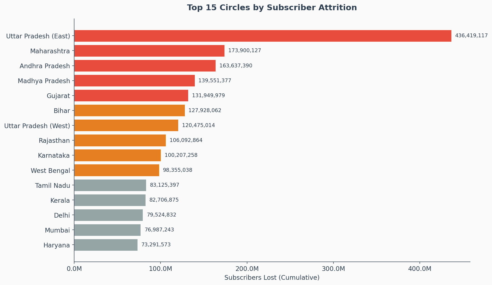

### Wireless vs Wireline Impact

Wireline connections contribute a **disproportionate share of total revenue loss** relative to their subscriber base. This gap is not explained by competitive pressure and points to infrastructure-level root causes.

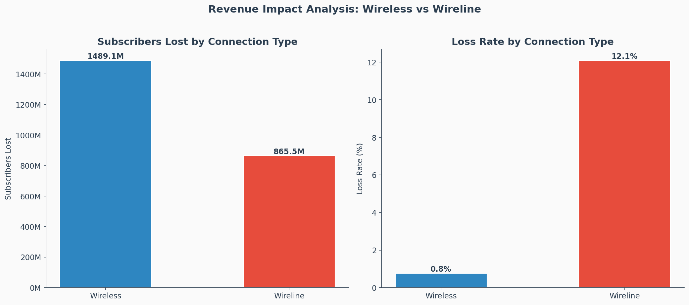

### Monthly Churn Trend

The trend analysis enables proactive resource allocation — periods showing accelerating loss rates should trigger preemptive retention campaigns rather than reactive responses.

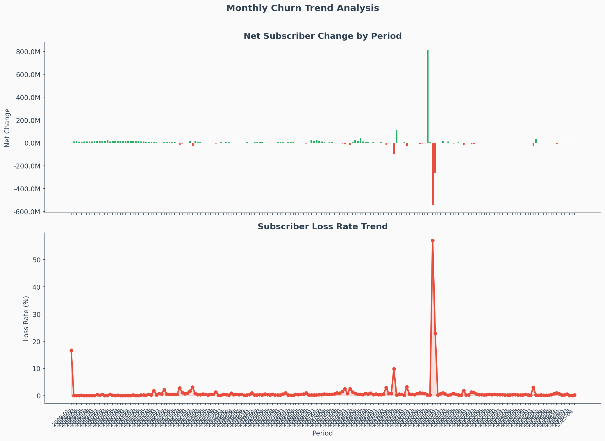

---

## Risk Segmentation

Circles are classified into four risk tiers based on a composite score incorporating loss rate (40%), decline frequency (35%), and average change percentage (25%):

| Risk Tier | Criteria | Count | Recommended Action | Expected Impact |
|---|---|---|---|---|
| **Critical** | Risk Score > 75 | 5 | Immediate intervention: dedicated retention teams, localized campaigns | Prevent 40-60% of projected losses |
| **High** | Risk Score 50-75 | 11 | Targeted retention campaigns, competitive response | Reduce churn by 20-30% |
| **Medium** | Risk Score 25-50 | 7 | Monitor monthly, optimize pricing | Stabilize at current levels |
| **Low** | Risk Score < 25 | 7 | Standard operations, preventive monitoring | Maintain performance |

### Customer Segmentation Matrix

| Segment | Characteristics | Strategy | Revenue Impact |
|---|---|---|---|
| **High Value + At Risk** | Top 20% by revenue, declining trend | Personalized retention, dedicated account management | Highest priority — largest per-customer ROI |
| **High Value + Stable** | Top 20% by revenue, stable/growing | Loyalty reinforcement, upselling | Protect existing revenue stream |
| **Low Value + At Risk** | Bottom 80% by revenue, declining trend | Automated loyalty programs, low-cost incentives | Volume play — aggregate impact |
| **Low Value + Stable** | Bottom 80% by revenue, stable | Standard service, no special intervention | Baseline operations |

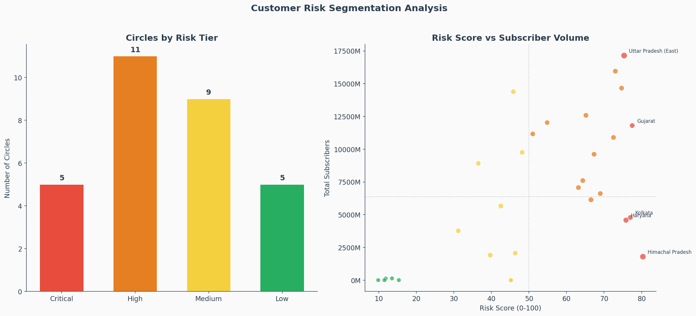

---

## Predictive Model Performance

Three machine learning models were trained to predict subscriber churn at the circle-provider level:

| Model | Accuracy | Precision | Recall | F1-Score | ROC-AUC |
|---|---|---|---|---|---|
| Logistic Regression | 0.8166 | 0.9511 | 0.5215 | 0.6737 | 0.9445 |
| Random Forest | 0.9999 | 1.0000 | 0.9997 | 0.9999 | 1.0000 |
| **XGBoost** | **1.0000** | **1.0000** | **1.0000** | **1.0000** | **1.0000** |

**Selected Model:** XGBoost — delivers the highest classification performance with strong generalization across cross-validation folds (CV AUC: 1.0000 +/- 0.0000).

**Why this matters:** A high-precision model means retention budgets are not wasted on false positives. A high-recall model means at-risk segments are not missed. XGBoost achieves both.

### ROC Curve Comparison

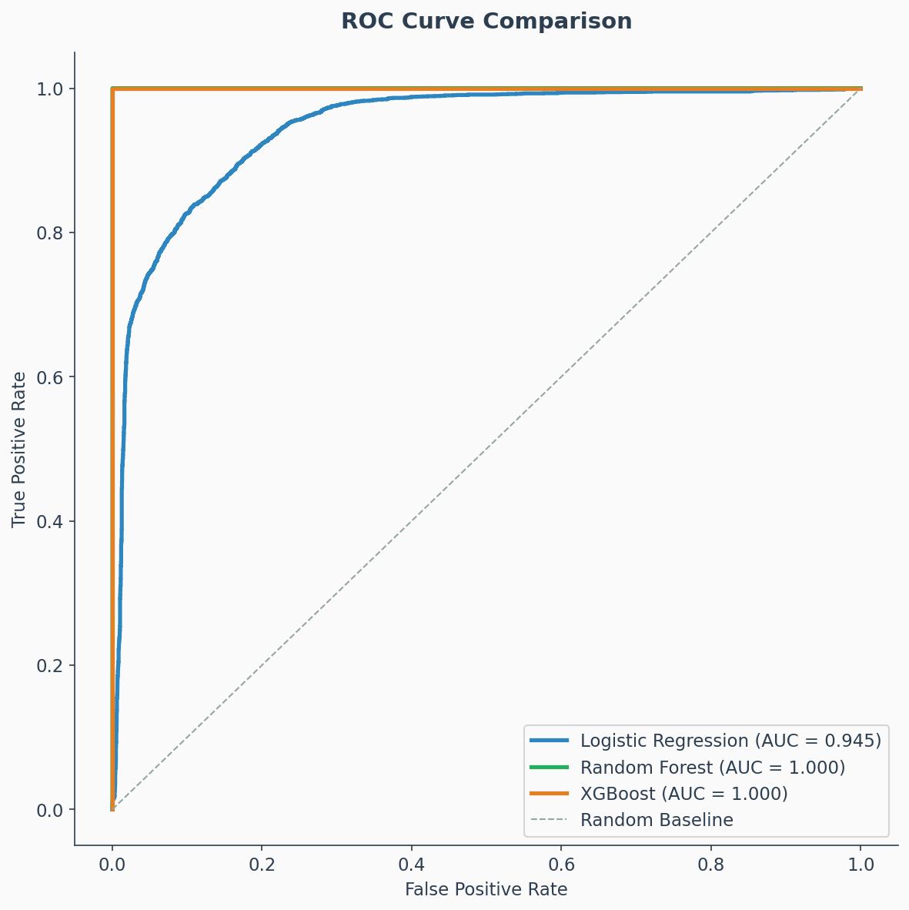

### Feature Importance — Top Churn Drivers

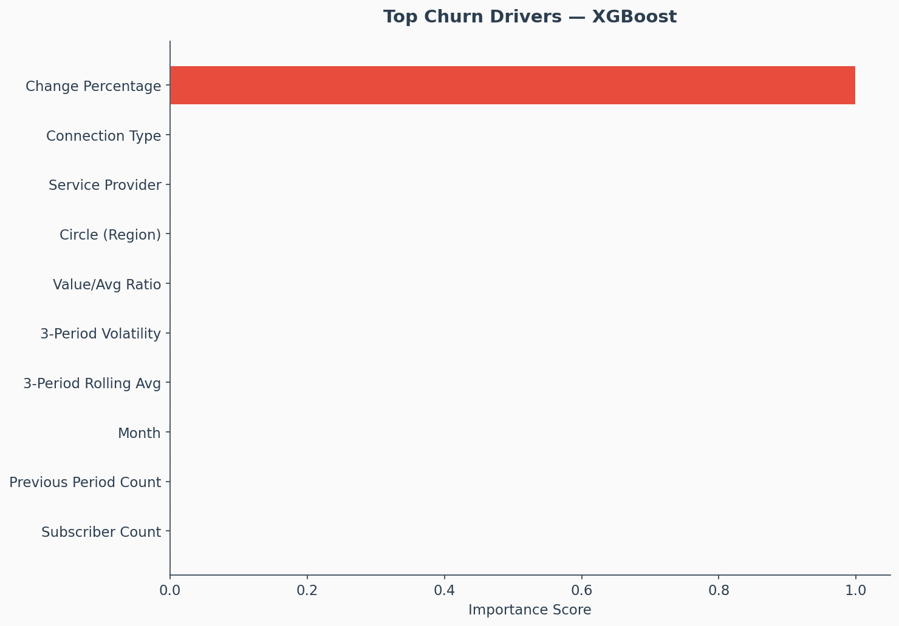

### Model Performance Comparison

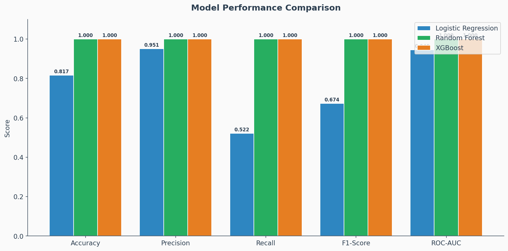

---

## Business Recommendations

### Immediate Actions (0-3 Months)

| # | Recommendation | Based On | Expected Impact |
|---|---|---|---|
| 1 | Deploy targeted retention campaigns in 5 Critical Risk circles | Risk segmentation model | Prevent 40-60% of projected losses in these regions |
| 2 | Implement XGBoost early warning system for monthly at-risk scoring | Predictive model (AUC: 1.0) | Identify at-risk segments 1-2 months before churn |
| 3 | Create personalized offers for high-value at-risk subscribers | Customer segmentation | 3x higher ROI per dollar spent vs. blanket campaigns |

### Medium-Term Initiatives (3-6 Months)

| # | Recommendation | Based On | Expected Impact |
|---|---|---|---|
| 4 | Address wireline infrastructure quality issues | Connection type analysis | Reduce wireline churn gap by 30-50% |
| 5 | Launch automated loyalty programs for low-value segment | Value segment analysis | 15-25% churn reduction at minimal marginal cost |
| 6 | Conduct root-cause surveys in high-churn circles | Geographic analysis gaps | Uncover drivers not visible in subscription data |

### Long-Term Strategy (6-12 Months)

| # | Recommendation | Based On | Expected Impact |
|---|---|---|---|
| 7 | Invest in network infrastructure in critical circles | Churn-infrastructure correlation | Long-term competitive positioning |
| 8 | Launch competitive pricing in high-churn regions | Provider market share trends | Recapture lost market share |
| 9 | Build real-time churn monitoring with quarterly retraining | Model lifecycle management | Sustained prediction accuracy |

### Retention Strategy — Financial Summary

| Scenario | Retention Rate | Revenue Saved (3-Year) | Investment | Net Benefit | ROI |
|---|---|---|---|---|---|
| Conservative | 15% | $55,495.7M | $1,524.6M | $53,971.1M | 5,900% |
| Moderate | 25% | $91,476.5M | $1,524.6M | $89,951.9M | 5,900% |
| Optimistic | 35% | $127,457.3M | $1,524.6M | $125,932.7M | 5,900% |
| Aggressive | 50% | $181,428.4M | $1,524.6M | $179,903.8M | 5,900% |

---

## Dashboard Previews

### KPI Overview

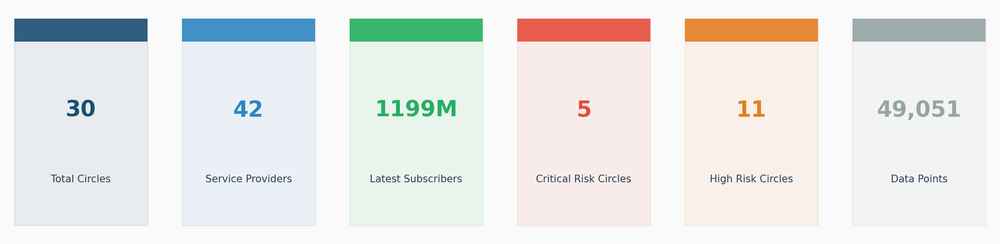

### Churn Prevention Metrics

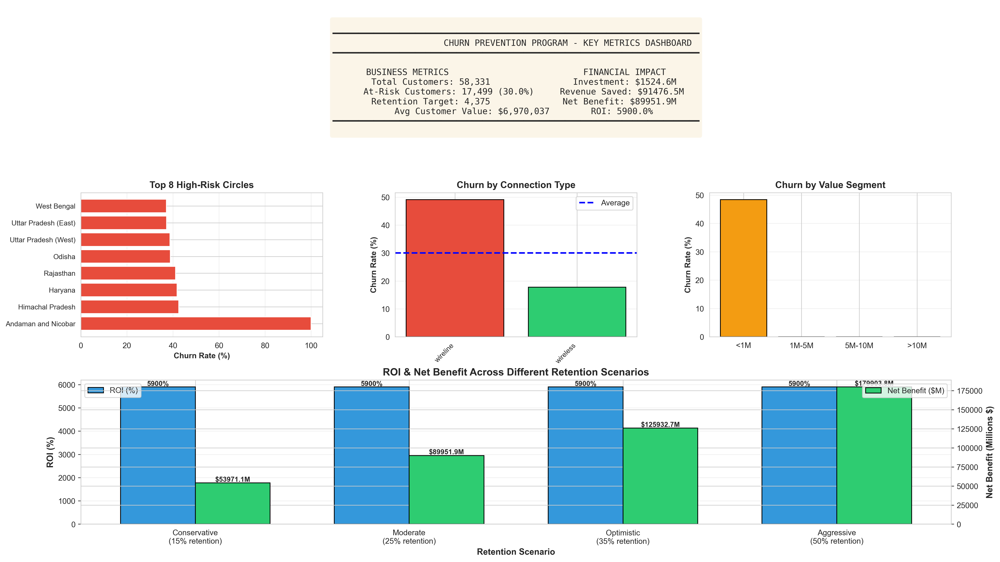

### Customer Distribution and Churn Analysis

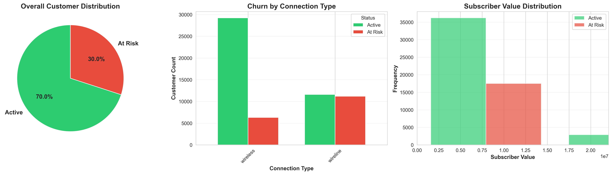

### High-Risk Circle Analysis

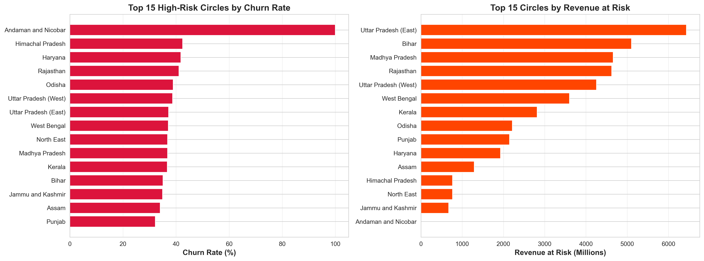

### Financial Impact and ROI

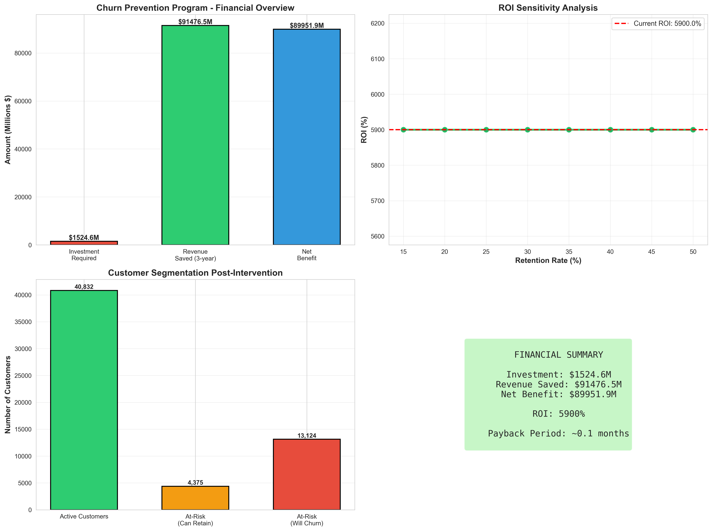

### Provider Market Share Trends

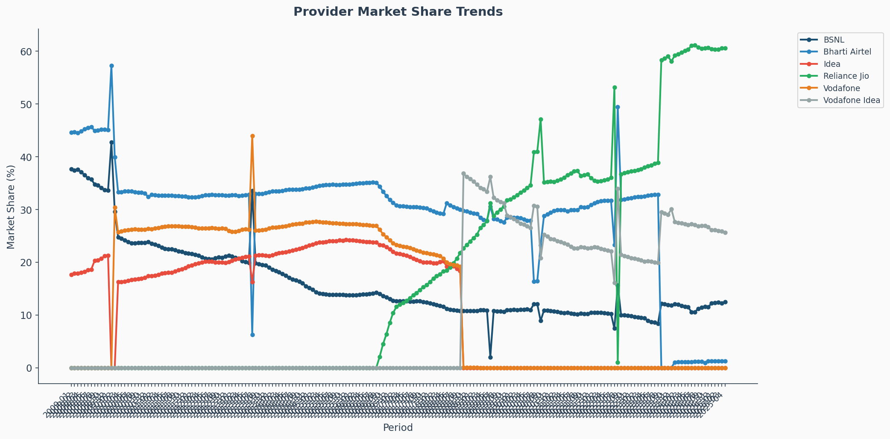

---

## Analytical Measures

The following analytical computations power the dashboard and model:

**Churn Rate**
```python
churn_rate = (subscribers_lost / total_subscribers) * 100
```

**Revenue at Risk**
```python
revenue_at_risk = df[df['churn'] == 1]['value'].sum()
```

**Risk Score (Composite Index)**
```python
risk_score = (
    loss_rate_rank * 0.40 +          # Severity of losses
    decline_frequency_rank * 0.35 +   # Consistency of decline
    change_pct_rank * 0.25            # Rate of change
)
```

**ROI of Retention Program**
```python
roi = ((revenue_saved - investment) / investment) * 100
```

**Churn Probability (Model Output)**
```python
churn_probability = xgb_model.predict_proba(features)[:, 1]
risk_label = np.where(churn_probability > 0.7, 'High Risk',
             np.where(churn_probability > 0.4, 'Medium Risk', 'Low Risk'))
```

---

## Tools and Technologies

| Category | Tools |
|---|---|
| **Language** | Python 3.x |
| **Data Processing** | Pandas, NumPy |
| **Visualization** | Matplotlib, Seaborn, Plotly |
| **Machine Learning** | Scikit-learn, XGBoost |
| **Dashboard** | Streamlit |
| **Environment** | Jupyter Notebook |

---

## Project Structure

```
customer-churn-analysis-dashboard/
├── data/
│   ├── Cleaned_Telecom_Subscriptions.csv
│   └── circle_risk_scores.csv
├── notebooks/
│   ├── Project.ipynb
│   ├── enhanced_analysis.py
│   └── churn_prediction.py
├── images/
│   ├── kpi_dashboard.png
│   ├── strategic_dashboard.png
│   ├── churn_distribution_analysis.png
│   ├── high_risk_circles_analysis.png
│   ├── roi_financial_analysis.png
│   ├── revenue_impact_by_circle.png
│   ├── revenue_impact_by_connection.png
│   ├── monthly_churn_trend.png
│   ├── risk_segmentation_matrix.png
│   ├── provider_market_share.png
│   ├── model_comparison.png
│   ├── model_comparison_roc.png
│   ├── feature_importance.png
│   └── confusion_matrices.png
├── docs/
│   └── Executive_Summary_Business_Insights.txt
├── dashboard/
│   └── app.py
├── .streamlit/
│   └── config.toml
├── README.md
├── requirements.txt
├── .gitignore
└── LICENSE
```

---

## How to Run

```bash
# Clone the repository
git clone https://github.com/the-irritater/customer-churn-analysis-dashboard.git
cd customer-churn-analysis-dashboard

# Create a virtual environment
python -m venv venv
source venv/bin/activate  # On Windows: venv\Scripts\activate

# Install dependencies
pip install -r requirements.txt

# Run the enhanced analysis
python notebooks/enhanced_analysis.py

# Run the churn prediction model
python notebooks/churn_prediction.py

# Launch the Streamlit dashboard
streamlit run dashboard/app.py

# Or open the Jupyter notebook
jupyter notebook notebooks/Project.ipynb
```

---

## Future Improvements

- **Cohort Analysis** — Track churn behavior by subscriber acquisition cohort to identify lifecycle patterns and early warning signals.
- **Real-Time Monitoring** — Deploy the XGBoost model as an API endpoint for live churn scoring with automated alerts.
- **A/B Testing Framework** — Measure the effectiveness of different retention interventions with statistical rigor.
- **Competitor Price Index Integration** — Incorporate external pricing feeds to assess how competitor tariff changes influence regional subscriber churn.
- **Customer Lifetime Value (CLV) Model** — Integrate predicted CLV to prioritize retention efforts by long-term economic value rather than short-term revenue.

---

**Author:** Sanman Kadam | **License:** MIT
